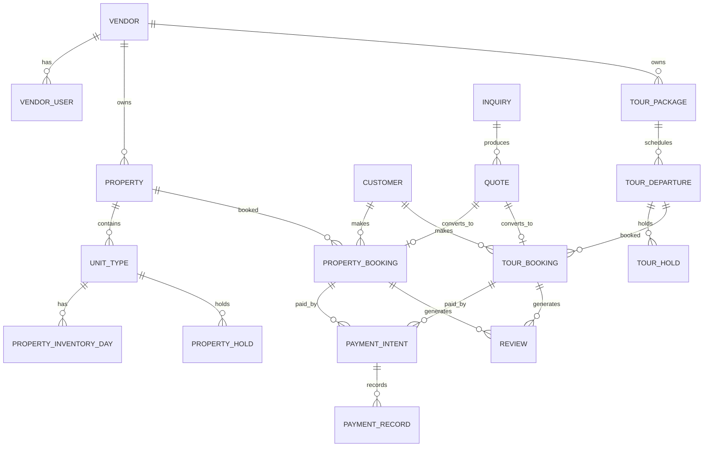

# ERD v1 (Conceptual)

This is a conceptual ERD for MVP. It defines explicit domains without universal listings or unified
inventory abstractions.

## Major Entities

- Vendor, VendorUser, VendorProfile
- Property, UnitType, PropertyInventoryDay, PropertyHold
- PropertyBooking, BookingGuest
- TourPackage, TourDeparture, TourHold, TourBooking
- Inquiry, Quote
- Customer
- PaymentIntent, PaymentRecord, Refund
- Review
- ManualTask, AuditLog

## Relationships and Cardinality (MVP)

- Vendor 1:N Property
- Property 1:N UnitType
- UnitType 1:N PropertyInventoryDay
- UnitType 1:N PropertyHold
- Property 1:N PropertyBooking
- Customer 1:N PropertyBooking
- Vendor 1:N TourPackage
- TourPackage 1:N TourDeparture
- TourDeparture 1:N TourHold
- TourDeparture 1:N TourBooking
- Customer 1:N TourBooking
- Inquiry 1:N Quote
- Quote 0:1 -> PropertyBooking or TourBooking (exactly one)
- PropertyBooking 1:N PaymentIntent
- TourBooking 1:N PaymentIntent
- PaymentIntent 0:N PaymentRecord
- Booking 1:N Review (post-completion)

## Ownership Rules

- Vendors own properties and tour packages.
- Bookings belong to customers and reference a single vendor-owned inventory asset.
- Payment intents belong to a single booking (property or tour).
- Manual tasks and audit logs are global and reference the affected aggregate.

## Aggregate Boundaries (Summary)

- Vendor Aggregate
- Property Aggregate
- Property Inventory Aggregate
- Property Booking Aggregate
- Tour Package Aggregate
- Tour Departure Aggregate
- Tour Booking Aggregate
- Inquiry Aggregate
- Payment Aggregate

## Mermaid Overview

## Notes

- PaymentIntent references exactly one booking type.
- Review references a completed booking and vendor-owned asset.
- Holds are time-boxed and cleared on expiry.
