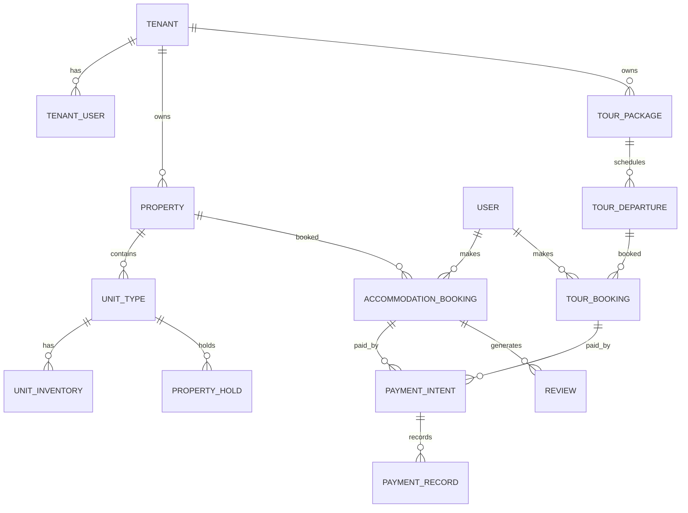

# ERD v1 (Conceptual)

This is a conceptual ERD for MVP. It defines explicit domains without universal listings or unified
inventory abstractions.

## Status

This document previously used legacy naming (`Vendor`, `Customer`, `PropertyBooking`, `RoomInventory`).
The current implementation is **Prisma + PostgreSQL** and uses the following canonical names:

- Vendor → `Tenant`
- VendorUser → `TenantUser`
- Customer → `User` (global identity)
- PropertyBooking → `AccommodationBooking`
- PropertyInventoryDay / RoomInventory → `UnitInventory`
- RoomCategory → `UnitType`

Entities listed below that do not exist in `packages/database/prisma/schema.prisma` should be treated as **planned** only.

## Major Entities

### Implemented in Prisma schema

- `Tenant`, `TenantUser`, `TenantInvite`, `TenantApplication`
- `User`
- `Property`, `UnitType`, `UnitInventory`, `PropertyHold`
- `AccommodationBooking`, `BookingGuest`, `BookingSpecialRequest`, `Reservation`, `BookingPriceSnapshot`, `AccommodationBookingStatusHistory`
- `TourPackage`, `TourDeparture`, `TourBooking`, `TourItineraryDay`
- `PaymentIntent`, `PaymentRecord`, `Refund`
- `Review`, `TourReview`
- `AuditLog`
- `PropertyInquiry`, `SupportTicket`, `Notification`

### Planned / not implemented in schema

- VendorProfile, PayoutProfile, PayoutBatch
- Inquiry/Quote (as separate aggregates; current schema has `PropertyInquiry` only)
- ManualTask
- TourHold (capacity holds are not modeled separately yet)

## Relationships and Cardinality (MVP)

Core implemented relationships:

- `Tenant` 1:N `Property`
- `Property` 1:N `UnitType`
- `UnitType` 1:N `UnitInventory`
- `UnitType` 1:N `PropertyHold`
- `Property` 1:N `AccommodationBooking`
- `User` 1:N `AccommodationBooking`
- `AccommodationBooking` 1:N `Reservation`
- `Reservation` N:1 `UnitInventory`
- `Tenant` 1:N `TourPackage`
- `TourPackage` 1:N `TourDeparture`
- `TourDeparture` 1:N `TourBooking`
- `User` 1:N `TourBooking`
- `PaymentIntent` (polymorphic) references exactly one booking via (`bookingType`, `bookingId`)
- `PaymentIntent` 0:N `PaymentRecord`
- `PaymentIntent` 0:N `Refund`
- `AccommodationBooking` 0:1 `Review` (one review per booking)

## Ownership Rules

- Tenants own properties and tour packages.
- Bookings belong to users and reference a single tenant-owned catalog/inventory asset.
- Payment intents belong to a single booking (accommodation or tour) via booking type.
- Audit logs are append-only and may reference tenant activity.

## Aggregate Boundaries (Summary)

- Vendor Aggregate
- Property Aggregate
- Property Inventory Aggregate
- Property Booking Aggregate
- Tour Package Aggregate
- Tour Departure Aggregate
- Tour Booking Aggregate
- Inquiry Aggregate
- Payment Aggregate

## Mermaid Overview

## Notes

- PaymentIntent references exactly one booking type.
- Review references a completed booking and vendor-owned asset.
- Holds are time-boxed and cleared on expiry.
