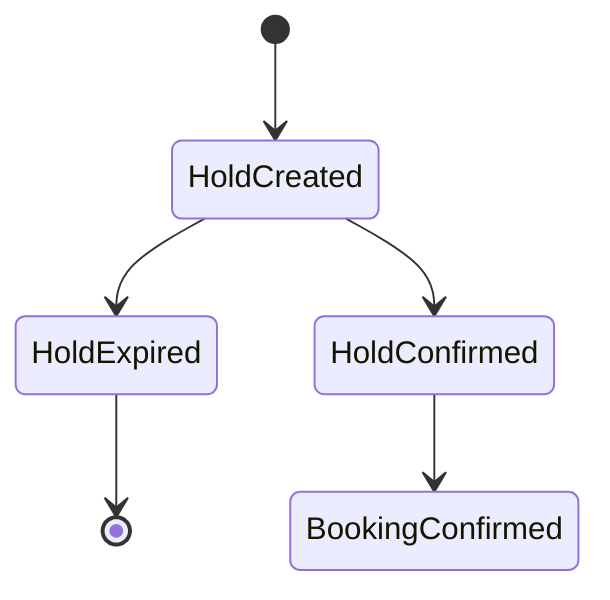

# Inventory Locking Strategy

## Property Holds

- Holds are created per unit type and date range.
- Each hold has a TTL and an idempotency key.
- Holds are released on expiry or cancellation.

## Tour Capacity Holds

- Holds are created per departure with seat count.
- Holds expire automatically and release capacity.

## Hold Lifecycle

## Release Rules

- On cancellation, release holds immediately.
- On expiry, release by background job or scheduled task.

## Inventory Decrement Rules

- Availability decrements only on confirmed booking.
- Holds reduce available count temporarily.

## Manual Adjustments

- Manual overrides require reason and actor identity.
- Overrides do not alter historical bookings.
