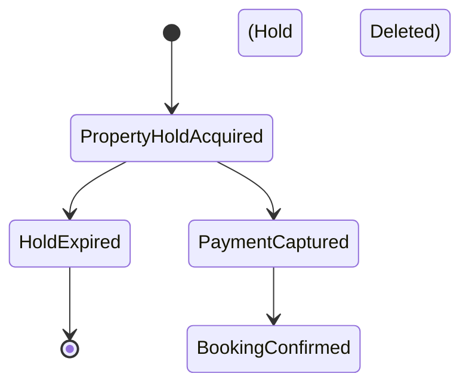

# Inventory Locking Strategy

## Property Holds

This repo utilizes **PropertyHold** as the canonical mechanism for reserving inventory during the guest checkout flow.

- `PropertyHold` rows hold the unitType, date range (`lt: endDate` internally), quantity, and an `expiresAt` timestamp.
- When a hold is acquired, `UnitInventory` available counts are decremented immediately.
- A background worker (`hold-expiry` job) automatically monitors and clears expired `PropertyHold` rows, releasing the inventory back to the pool if the guest abandons checkout.
- Upon successful Stripe payment, the webhook handler converts the `PropertyHold` into a confirmed `AccommodationBooking` and deletes the `PropertyHold` row, persisting the inventory consumption.

We do **not** use `AccommodationBooking` with `status=PENDING` as the active checkout hold path. Bookings are only created once payment is guaranteed.

## Tour Capacity Holds

- Holds are created per departure with seat count.
- Holds expire automatically and release capacity.

## Hold Lifecycle

## Release Rules

- On guest cancellation of a hold, release holds immediately.
- On expiry, release by background BullMQ job.

## Inventory Decrement Rules

Current implemented behavior:

- During the `PropertyHold` period, inventory is treated as reserved (availability reduced).
- On expiry/cancellation of a `PropertyHold`, the worker releases the reserved inventory.
- On `CONFIRMED` booking conversion, inventory remains consumed. Release only happens via manual staff action or guest cancellation flows.

## Manual Adjustments

- Manual overrides require reason and actor identity.
- Overrides do not alter historical bookings.
