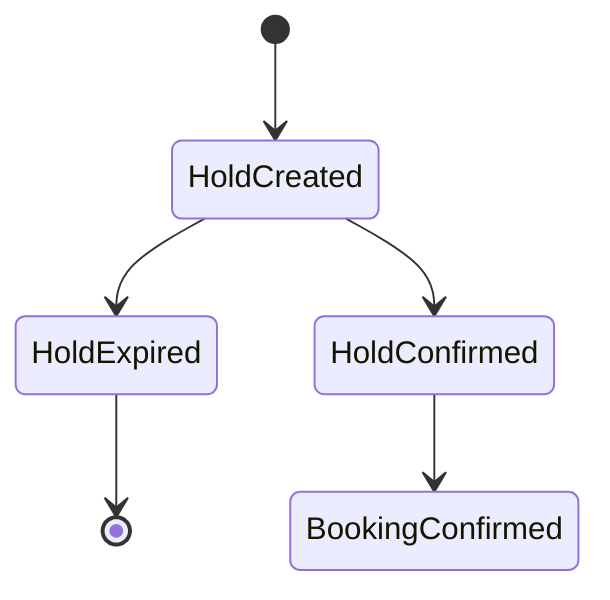

# Inventory Locking Strategy

## Property Holds

This repo currently has **two hold-related mechanisms**:

- `PropertyHold` rows: unitType + date range + quantity + `expiresAt` (+ optional `idempotencyKey`)
- `AccommodationBooking` rows with `status=PENDING` + `holdExpiresAt`

Until the booking module is fully implemented, the **worker expiry job** assumes inventory is reserved during the `PENDING` period and must be released if the booking expires/cancels.

MVP guidance: pick **one** hold primitive and make booking confirmation validate hold ownership.

## Tour Capacity Holds

- Holds are created per departure with seat count.
- Holds expire automatically and release capacity.

## Hold Lifecycle

## Release Rules

- On cancellation, release holds immediately.
- On expiry, release by background job or scheduled task.

## Inventory Decrement Rules

Current direction (to align with existing expiry job behavior):

- During `PENDING`, inventory is treated as reserved for that booking window (availability reduced).
- On expiry/cancellation of a `PENDING` booking, release the reserved inventory.
- On `CONFIRMED`, inventory remains consumed; release happens only on cancellation flows (policy-driven; not fully implemented yet).

## Manual Adjustments

- Manual overrides require reason and actor identity.
- Overrides do not alter historical bookings.
