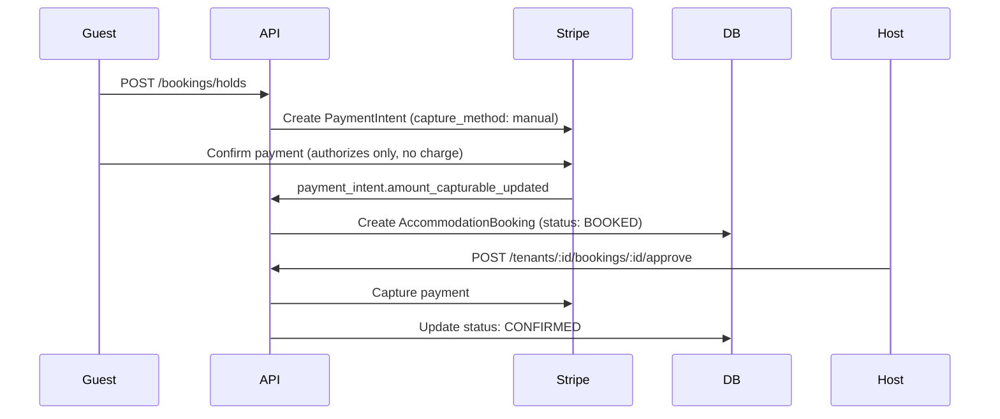
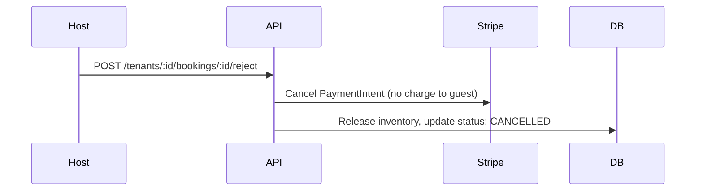
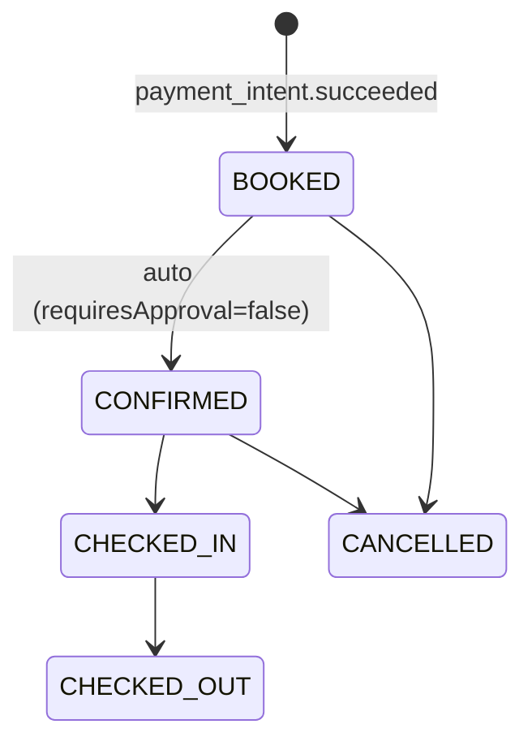
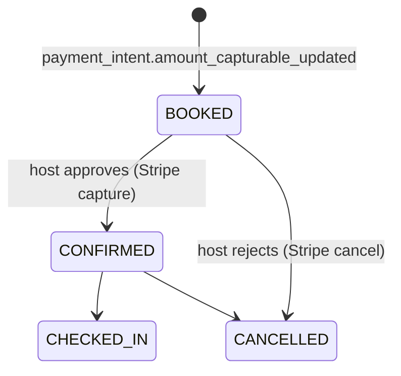
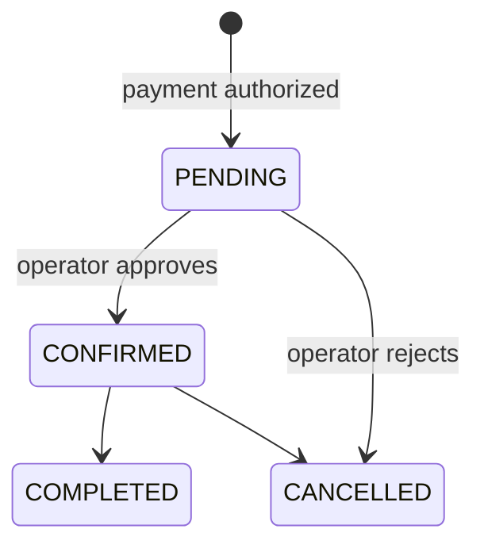

# Booking Lifecycle

This platform supports two booking domains — **Accommodation** and **Tours** — with distinct
lifecycle models. Manual confirmations and offline payments are first-class in MVP.

---

## Accommodation Booking Lifecycle

### States

The implemented database lifecycle for accommodation bookings is the `AccommodationBookingStatus`
enum in Prisma:

| Status        | Meaning                                                      |
| ------------- | ------------------------------------------------------------ |
| `PENDING`     | Booking created, awaiting payment (webhook not yet received) |
| `BOOKED`      | Payment authorized or captured; awaiting host confirmation   |
| `CONFIRMED`   | Host confirmed; guest is scheduled to arrive                 |
| `CHECKED_IN`  | Guest has arrived at the property                            |
| `CHECKED_OUT` | Guest has departed                                           |
| `CANCELLED`   | Cancelled by guest, host, or system                          |
| `NO_SHOW`     | Guest did not arrive                                         |

### Pre-Booking: The Hold System

An `AccommodationBooking` row is **not** created until Stripe confirms payment. Before payment,
inventory is reserved via a `PropertyHold`:

1. `POST /bookings/holds` → creates a `PropertyHold` and decrements `UnitInventory.availableCount`.
2. `POST /payments/intent` → creates or reuses a pending `PaymentIntent` for that hold.
3. Stripe webhook `payment_intent.succeeded` (or `payment_intent.amount_capturable_updated` for
   manual-capture properties) → booking is created.
4. Hold expiry, payment failure, or manual release → hold is deleted and inventory restored.

### Approval-Required Properties (`requiresApproval = true`)

Some properties require the host to manually confirm before charging the guest. These use Stripe's
**manual capture** strategy:

Rejection flow:

> **Key rule:** Stripe API calls (capture, cancel) must **never** occur inside a Prisma interactive
> transaction. Network latency will exceed the 5-second timeout. Use the Read → Act → Write pattern.

### Standard Flow (No Approval Required)

### Manual Confirmation Flow (`requiresApproval = true`)

### Guest Cancellation

Guests can cancel bookings in `PENDING`, `BOOKED`, or `CONFIRMED` states. The service:

- Restores reserved inventory.
- Records a cancellation reason and date.
- Appends an entry to `AccommodationBookingStatusHistory`.
- Refund automation is future work; currently stored as `refundAmount` on the booking.

### Invariants

- Every booking must have an immutable `BookingPriceSnapshot` attached.
- Booking status transitions are append-only and audited via `AccommodationBookingStatusHistory`.
- Stripe calls are idempotent: calling capture/cancel on an already-processed intent is handled gracefully.

---

## Tour Booking Lifecycle

The Tours module uses a fundamentally different inventory model. Instead of calendar availability,
tours operate on **TourDepartures** — specific dated slots with a fixed `maxCapacity`.

### States

The `TourBookingStatus` enum:

| Status      | Meaning                                                  |
| ----------- | -------------------------------------------------------- |
| `PENDING`   | Booking submitted, awaiting payment confirmation         |
| `CONFIRMED` | Payment complete; participant is booked on the departure |
| `CANCELLED` | Cancelled by participant or operator                     |
| `COMPLETED` | Departure has occurred                                   |

### Tour Booking Flow

Tours do **not** use a Hold model. Seat reservation is atomic with booking creation:

1. Guest submits `POST /tours/:id/departures/:departureId/book` with `numberOfPeople` and participant details.
2. API validates `bookedCount + numberOfPeople <= maxCapacity` inside a transaction.
3. Stripe payment is initiated. On success, `bookedCount` is atomically incremented.
4. Database constraint `CHECK (bookedCount <= maxCapacity)` enforces the hard cap at the DB level.

### Approval-Required Tours (`requiresApproval = true`)

Individual `TourPackage` records can set `requiresApproval = true` (e.g., private charters,
honeymoon packages). The flow mirrors the accommodation approval flow:

### Invariants

- `TourDeparture.bookedCount` is the source of truth for capacity. It must never exceed `maxCapacity`.
- `TourParticipant` rows must be created for every person in the booking (for passenger manifests).
- Price snapshots (`BookingPriceSnapshot`) are attached at booking creation and are immutable.
- Abandoned `PENDING` tour bookings (no payment after 30 minutes) are swept by the background worker.
