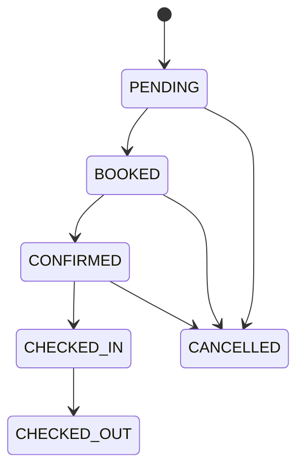
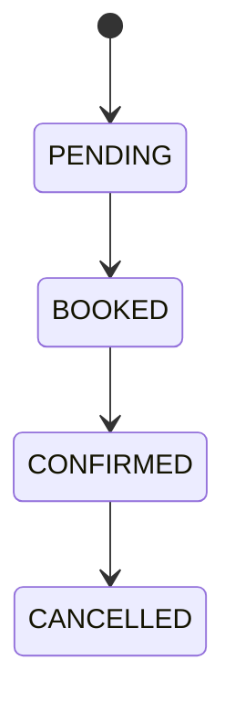
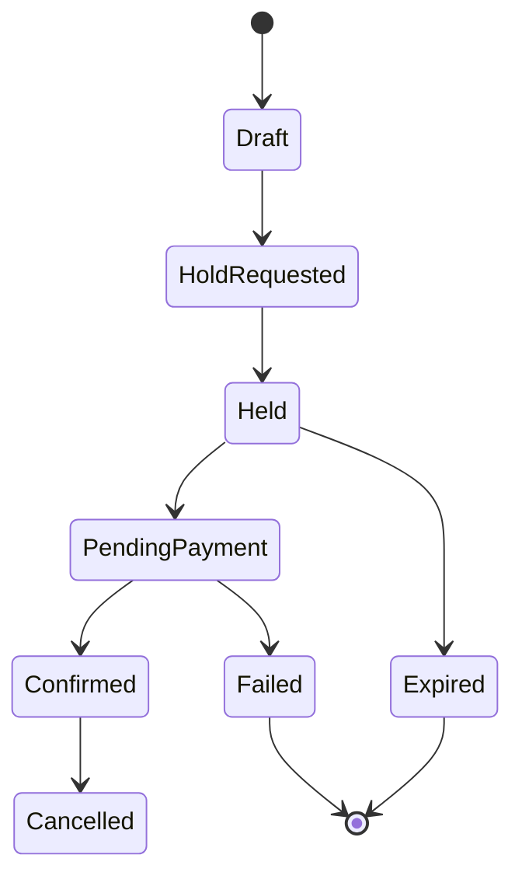
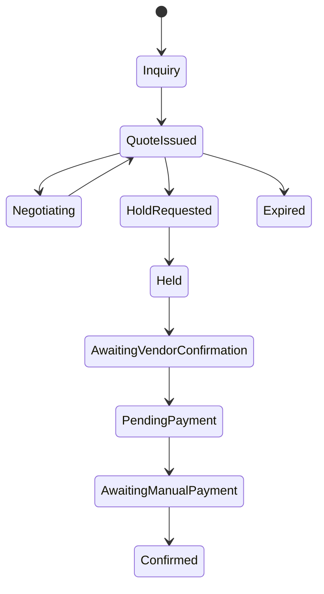

# Booking Lifecycle

This platform supports automated and manual booking flows. Manual confirmations and offline
payments are first-class in MVP.

## Property Booking Lifecycle

### States

This document previously described a conceptual lifecycle (Inquiry/Quote/Held/etc.). The **implemented**
database lifecycle for accommodation bookings is the `AccommodationBookingStatus` enum in Prisma:

- `PENDING`: booking created, inventory reserved for a limited time (hold expiry applies)
- `BOOKED`: payment captured/recorded, awaiting property/operator confirmation
- `CONFIRMED`: property/operator confirmed
- `CHECKED_IN`: guest arrived
- `CHECKED_OUT`: guest departed
- `CANCELLED`: cancelled by guest/operator/system
- `NO_SHOW`: guest did not arrive

Anything not listed above is **not represented as a first-class booking status** yet.

### Implemented Checkout Flow

The current accommodation checkout implementation uses `PropertyHold` as the temporary reservation before payment. An `AccommodationBooking` row is created only after Stripe confirms `payment_intent.succeeded`.

1. `POST /booking/holds` creates a `PropertyHold` and reserves inventory for the hold window.
2. `POST /payments/intent` creates or reuses a pending Stripe-backed `PaymentIntent` for that hold.
3. `payment_intent.succeeded` converts the hold into a `BOOKED` `AccommodationBooking`, records the payment, and deletes the hold.
4. `payment_intent.payment_failed`, `payment_intent.canceled`, manual release, or worker expiry releases the hold and restores inventory without creating a booking.

### Automated Flow (Typical)

### Manual Confirmation Flow

### Invariants

- A booking should not be moved forward in the lifecycle without an immutable price snapshot (`BookingPriceSnapshot`).
- Holds expire; the worker releases expired `PropertyHold` rows and restores inventory. Current code does not create a pending accommodation booking before payment.
- Booking status transitions should be append-only and audited (status history table exists).

## Tour Booking Lifecycle

Tours have two booking patterns: fixed departures and custom requests.

### Fixed Departure Flow (MVP)

### Custom Tour Request Flow

### Invariants

- Departure capacity is enforced for fixed tours.
- Custom tours require an accepted quote before holds.
- Manual confirmation is required when operators are coordinating.

## Concurrency and Holds

- Holds are first-come, first-served and time-boxed.
- Holds must be idempotent by client request ID.
- Confirmations re-validate hold ownership and quote validity.
- Booking status transitions are append-only and audited.
