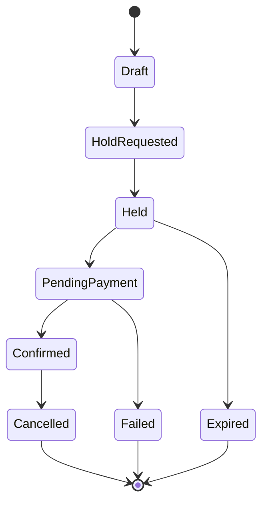
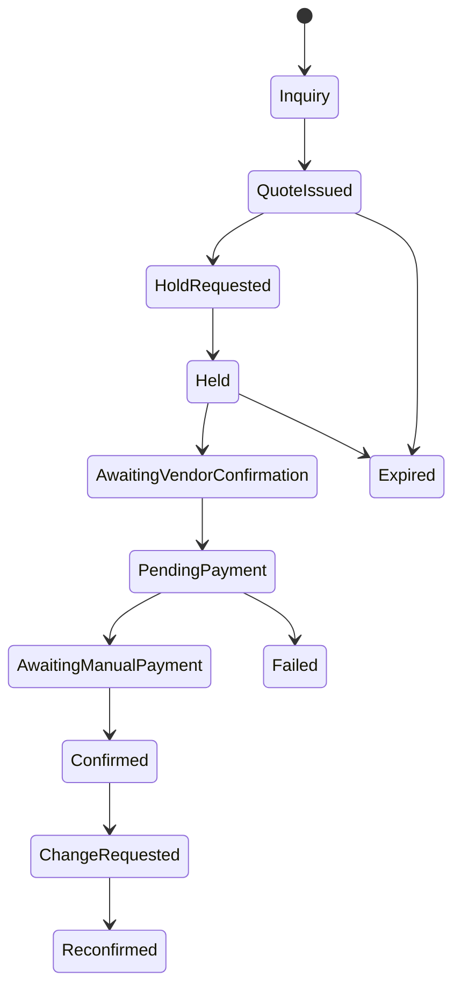
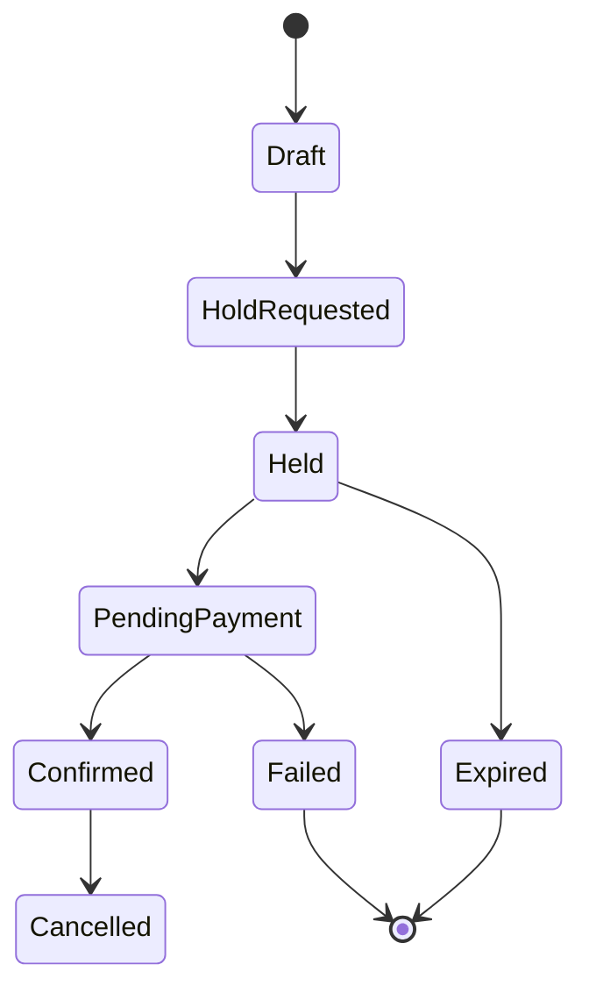
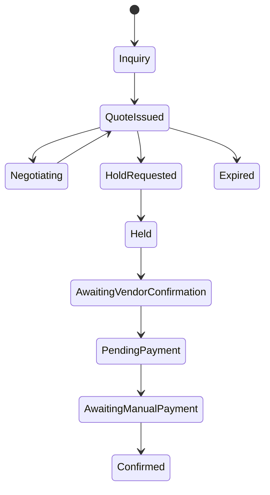

# Booking Lifecycle

This platform supports automated and manual booking flows. Manual confirmations and offline
payments are first-class in MVP.

## Property Booking Lifecycle

### States

- Inquiry: optional manual intake.
- QuoteIssued: negotiated offer with expiry.
- Draft: standard cart/checkout stage.
- HoldRequested: availability hold in progress.
- Held: availability reserved for a limited time.
- AwaitingVendorConfirmation: manual approval required by vendor/operator.
- PendingPayment: payment intent created.
- AwaitingManualPayment: offline payment pending verification.
- Confirmed: payment resolved and booking finalized.
- ChangeRequested: post-confirmation modification request.
- Reconfirmed: change approved and applied.
- Cancelled: user or vendor cancellation.
- Expired: hold or quote expired before confirmation.
- Failed: payment or validation failure.

### Automated Flow (Typical)

### Manual Confirmation Flow

### Invariants

- A booking cannot be confirmed without a valid hold and price snapshot.
- Manual approvals must be audited (who, when, reason).
- Quote expiries are enforced; re-quoting generates a new snapshot.
- Hold extensions are manual-only and recorded.

## Tour Booking Lifecycle

Tours have two booking patterns: fixed departures and custom requests.

### Fixed Departure Flow (MVP)

### Custom Tour Request Flow

### Invariants

- Departure capacity is enforced for fixed tours.
- Custom tours require an accepted quote before holds.
- Manual confirmation is required when operators are coordinating.

## Concurrency and Holds

- Holds are first-come, first-served and time-boxed.
- Holds must be idempotent by client request ID.
- Confirmations re-validate hold ownership and quote validity.
- Booking status transitions are append-only and audited.
