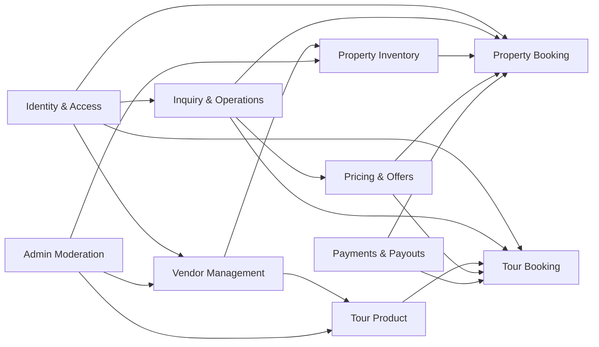

# Bounded Contexts

## Scope

This platform is a modular monolithic, multi-vendor travel commerce system. The MVP scope includes
property booking, vendor onboarding, admin moderation, and tour package management. Tours are a
separate domain from property booking.

## Contexts (MVP oriented)

### Vendor Management

- Purpose: vendor onboarding, compliance, and ownership of catalogs.
- Aggregates: Vendor, VendorProfile, PayoutProfile.
- Invariants: a vendor must be approved before publishing inventory; ownership boundaries are strict.
- Interactions: provides vendor identity to Inventory and Tour contexts.

### Property Inventory

- Purpose: property catalog, unit types, capacity, and availability.
- Aggregates: Property, UnitType, Unit, AvailabilitySnapshot.
- Invariants: inventory is owned by a vendor; availability cannot be negative.
- Interactions: supplies availability to Property Booking and Pricing.

### Property Booking

- Purpose: guest reservations for property stays.
- Aggregates: PropertyBooking, BookingGuest.
- Invariants: bookings require a valid hold and price snapshot; overlap is prevented by availability.
- Interactions: consumes Inventory, Pricing, and Payments.

### Tour Product

- Purpose: tour packages, itineraries, and departure schedules.
- Aggregates: TourProduct, Departure.
- Invariants: departures are owned by a vendor; capacity is per departure.
- Interactions: supplies availability to Tour Booking and Pricing.

### Tour Booking

- Purpose: guest reservations for tour departures.
- Aggregates: TourBooking, Participant.
- Invariants: bookings require a valid hold and price snapshot; capacity cannot be exceeded.
- Interactions: consumes Tour Product, Pricing, and Payments.

### Inquiry and Operations

- Purpose: handle inquiries, quotes, negotiations, and manual tasking.
- Aggregates: Inquiry, Quote, ManualTask.
- Invariants: quotes expire; manual overrides are audited.
- Interactions: feeds Booking, Pricing, and Vendor contexts.

### Pricing and Offers

- Purpose: compute prices from rate plans, seasonal rules, fees, and taxes.
- Aggregates: RatePlan, PriceRule, FeeSchedule.
- Invariants: pricing is deterministic for a given snapshot and rule set.
- Interactions: provides price snapshots to booking contexts.

### Payments and Payouts

- Purpose: payment intents, captures, refunds, and vendor payouts.
- Aggregates: PaymentIntent, Refund, PayoutBatch.
- Invariants: a booking must have exactly one active payment intent at a time.
- Interactions: consumes Booking data, exposes payment status.

### Admin Moderation

- Purpose: review vendors and listings, enforce policies.
- Aggregates: ModerationCase.
- Invariants: only moderators can change approval state.
- Interactions: reads Vendor, Property Inventory, Tour Product.

### Identity and Access

- Purpose: roles and permissions across the platform.
- Aggregates: RoleAssignment.
- Invariants: least-privilege access; vendor users cannot access other vendors.
- Interactions: used by all contexts for authorization decisions.

## Context Map (MVP)

## Boundary Notes

- Contexts are conceptual boundaries inside a modular monolith.
- No microservices, event sourcing, or cross-context circular ownership.
- Tours and properties remain separate domains to avoid premature abstraction.
