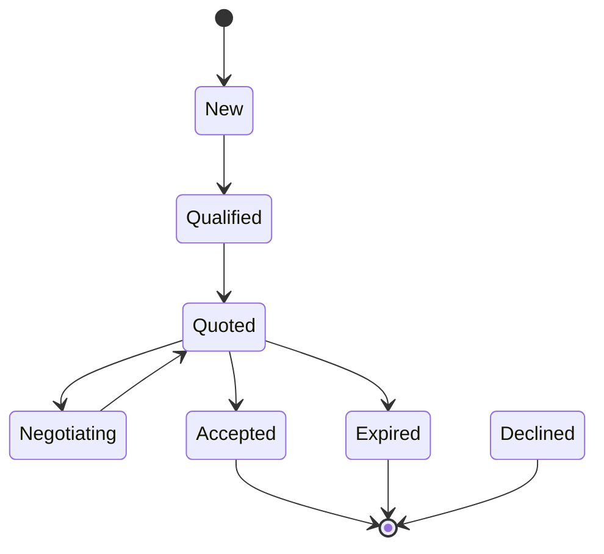

# Inquiry Workflow

## Purpose

Many bookings begin as manual inquiries (WhatsApp, phone, or email). This workflow captures intent,
negotiation, and quote acceptance before a hold or booking is created.

## Intake Channels

- Web form
- WhatsApp or phone
- Operator-initiated inquiry

## Inquiry States

- New: captured and awaiting triage.
- Qualified: scope, dates, and budget confirmed.
- Quoted: price snapshot issued with expiry.
- Negotiating: revisions or add-ons requested.
- Accepted: quote accepted and ready for hold.
- Expired: quote expiry reached.
- Declined: customer declines or no response.

## State Diagram

## Invariants

- A quote references a single inquiry and includes expiry.
- Accepted quotes create a hold request, not an immediate booking.
- Manual negotiations generate a new quote snapshot.
