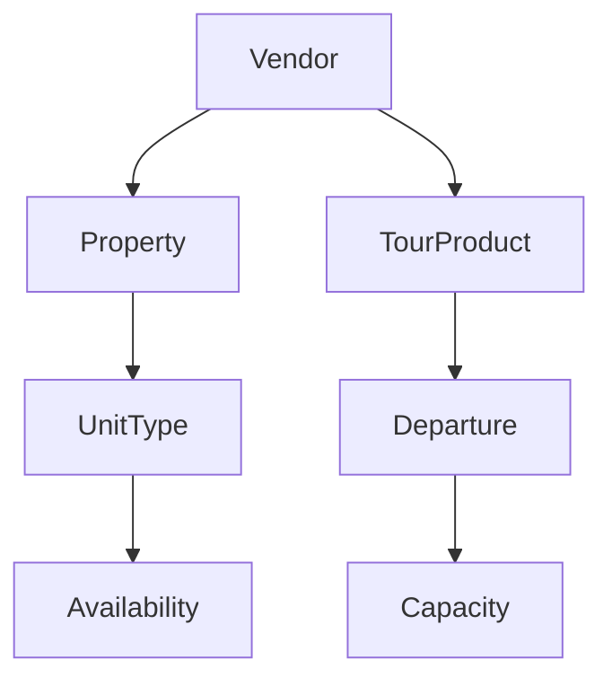

# Inventory Model

## MVP Decision: Quantity-Based Inventory

For MVP, properties are modeled with quantity-based inventory per unit type (e.g., Deluxe Room = 10).
This avoids premature complexity and matches manual operator workflows. Unit-level tracking is a
future enhancement.

## Property Inventory

### Structure

- Property contains one or more UnitTypes.
- UnitType is the sellable inventory class and carries quantity.
- Availability is modeled per date per unit type.

### Availability Model (MVP)

- Availability is a derived view of:
  - Base inventory (unit type quantity)
  - Holds (temporary)
  - Confirmed bookings
- Availability snapshots are used by Booking and Pricing.

Implementation note:

- The current Prisma schema represents per-date inventory in `UnitInventory` with `totalCount`, `availableCount`, `bookedCount`, `blockedCount` (with a DB CHECK constraint enforcing their sum).
- Current code uses `PropertyHold` for temporary checkout reservations. Holds consume inventory during the hold window and are released by manual release, failed/canceled payment, or the worker expiry sweeper.

### Manual Interventions

- Operators can adjust inventory with reason codes.
- Manual adjustments require audit trails (who, when, why).
- Overrides do not edit historical bookings.

### Invariants

- Availability cannot be negative.
- A hold must reserve a specific date range.
- Only the owning vendor or platform admin can change inventory.

## Tour Inventory

### Fixed Departures

- TourProduct contains Departures.
- Departure has a fixed capacity and optional booking cutoff.
- Capacity is decremented by holds and confirmed bookings.

### Custom Tours

- Custom tours do not use departures.
- Capacity is managed by operator-defined limits and manual checks.

### Invariants

- Capacity cannot be exceeded for departures.
- Departure times are immutable once bookings exist.

## Inventory Ownership

- Vendors own and manage their inventory.
- Platform moderators can approve, suspend, or flag inventory.

## Concurrency Assumptions

- Holds are managed with optimistic concurrency or transactional updates.
- Booking confirmation requires a valid hold token.
- Availability reads are eventually consistent but booking writes are strictly consistent.

## Inventory Relationships

