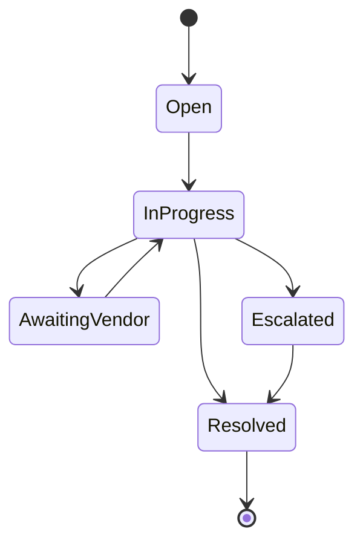

# Manual Operations

## Why It Exists

Operational coordination is central to the MVP: vendor confirmations, offline payments, and
inventory exceptions require human intervention.

## Manual Task Types

- Vendor confirmation
- Payment verification
- Inventory adjustment
- Price override approval
- Booking change review

## Manual Task Lifecycle

## Invariants

- Every manual action is attributed to an operator.
- Manual overrides must record reason and timestamp.
- Tasks are linked to the booking or inquiry they affect.
