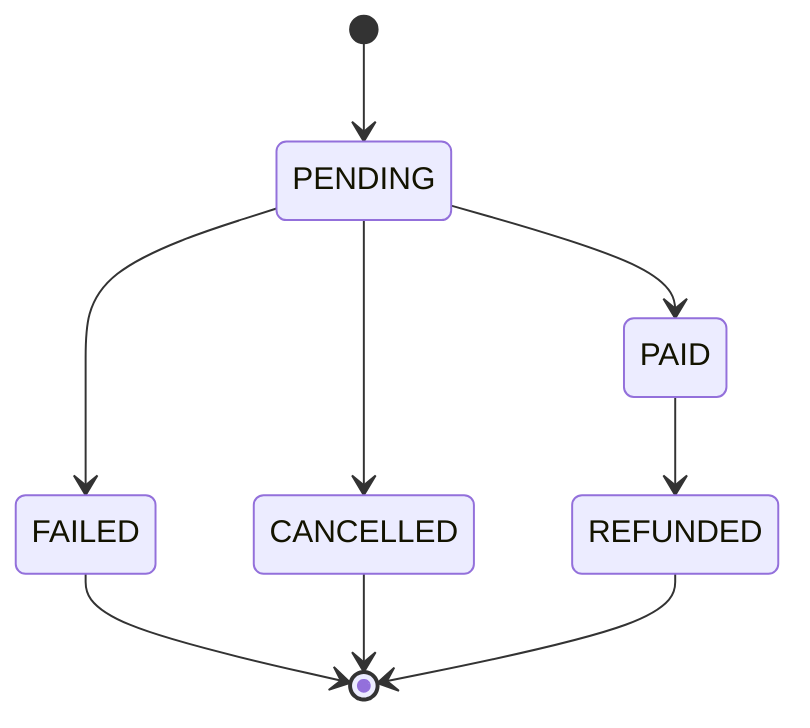

# Payment Domain

## Purpose

Payments handle authorization, capture, refunds, manual verification, and vendor payouts for both
property and tour bookings.

## Core Entities

- PaymentIntent
- PaymentRecord
- Refund

Note: `ManualPaymentProof` and `PayoutBatch` are documented concepts but are **not implemented in the current Prisma schema**.

## Supported Methods (MVP)

- Card (gateway)
- Bank transfer
- Easypaisa / JazzCash
- Cash or in-person

## Payment Intent Lifecycle

## Manual Payment Flow

1. Booking enters AwaitingManualPayment.
2. Customer submits proof (receipt, transfer ID).
3. Operator verifies and records PaymentRecord.
4. Booking is confirmed once payment is verified.

Note: The current Prisma model does not represent `AwaitingManualPayment` as a distinct status; implementers can model manual verification using `PaymentProvider=MANUAL` and `PaymentStatus=PENDING` until expanded.

## Invariants

- One active payment intent per booking.
- Manual payments must store proof and operator identity.
- Refunds must reference a captured payment.

## Payouts (MVP)

- Payouts are aggregated by vendor.
- Platform fees are deducted prior to payout.
- Payouts are triggered after stay or tour completion.

Note: payout entities are not implemented in the current Prisma schema.
