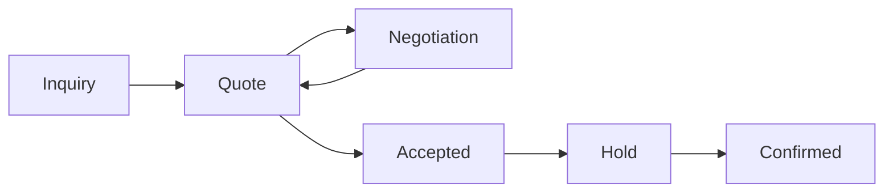

# Tour Domain

## Domain Separation

Tours are a distinct domain from property booking. They have different inventory units (departures)
and pricing units (participants), so they are not modeled as property stays.

## Tour Product Types (MVP)

### FixedDepartureTour

- Scheduled departures with capacity and cutoff.
- Inventory and pricing are per departure.

### CustomTourRequest

- Operator-managed itinerary and pricing.
- Typically starts as an inquiry and quote.

## Core Aggregates

- TourProduct: package definition, inclusions, and policies.
- Departure: dated occurrence with capacity and cutoff.
- TourBooking: reservation for a departure.
- CustomTourRequest: inquiry-driven request with negotiated quote.

## Custom Tour Workflow

## Invariants

- A departure cannot be modified once bookings exist.
- Capacity cannot be exceeded.
- Custom tours require an accepted quote before holds.
- Tours and properties do not share availability or pricing rules.

## Tour Lifecycle

- Draft -> Published -> Archived
- Departures can be scheduled only for published tours.
- Custom tour requests are closed after confirmation or expiry.
