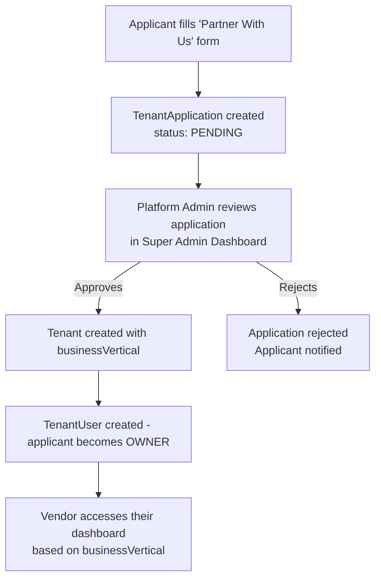

# Vendor Onboarding

This document describes how businesses (accommodation vendors and tour operators) are onboarded
onto the Khan Familia platform, and how the platform admin controls access.

---

## Overview

Not every registered user can create and manage listings on the platform. Vendors must be
approved by the platform admin before they can publish inventory or accept bookings. This
protects guests from unverified suppliers and ensures platform quality.

---

## The Two Vendor Types

| Vertical               | Examples                                 | API Access                          |
| ---------------------- | ---------------------------------------- | ----------------------------------- |
| `ACCOMMODATIONS_STAYS` | Hotels, villas, guest houses, apartments | Property catalog, room bookings     |
| `EXPERIENCES_TOURS`    | Tour operators, travel agencies          | Tour packages, departures, bookings |

The vertical is recorded on the `Tenant` model and enforced in API middleware.

---

## The Application Flow (Planned — Not Yet Implemented)

The professional end-to-end onboarding flow is:

### Application Data Collected

The `TenantApplication` model stores:

- Full name and phone number.
- Business name, address, city, country.
- `businessVertical`: what type of vendor they are.
- Government ID type and number (must be encrypted at rest — see security note).
- Business registration number (must be encrypted — see security note).
- Tax ID and business website (optional).
- Experience description and supporting documents (uploaded URLs).

> **Security:** `govIdNumber` and `businessRegNumber` in `TenantApplication` must be
> encrypted at the application layer before writing to the database. This is documented
> in the schema with a comment but encryption is not yet implemented.

### What Happens at Admin Approval

When the platform admin approves an application, the backend:

1. Creates a new `Tenant` record with the applicant's business details and `businessVertical`.
2. Sets the `TenantApplication.approvedTenantId` to the new tenant ID.
3. Creates a `TenantUser` record linking the applicant's `User` to the new tenant with role `OWNER`.
4. Updates `TenantApplication.status` to `APPROVED`.

At next login, the frontend detects the tenant membership and routes the user to their
vertical-specific dashboard.

---

## Current State (MVP Workaround)

The `TenantApplication` review flow (the API endpoints to submit and admin-approve applications)
has **not yet been implemented**. For the MVP period, tenant creation uses one of:

1. **Self-serve `POST /tenants`**: A user creates their own tenant directly. This is available
   but does not go through KYC review.
2. **Manual DB seeding**: For the first tour operator (platform owner's brother), the tenant
   can be created directly in the database via seed script with `businessVertical = 'EXPERIENCES_TOURS'`.

When the onboarding module is built, it will introduce:

- `POST /applications` — submit an application.
- `GET /admin/applications` — list pending applications (SUPER_ADMIN only).
- `POST /admin/applications/:id/approve` — approve and create tenant.
- `POST /admin/applications/:id/reject` — reject with reason.

---

## Vendor Responsibilities After Onboarding

- **Accommodation vendors**: Maintain accurate unit inventory and availability windows. Respond
  to manual confirmation requests. Comply with platform cancellation policies.
- **Tour operators**: Publish accurate package information, itineraries, and departure dates.
  Manage passenger manifests. Confirm or reject bookings within a reasonable time window.

---

## Vendor Statuses

| Status     | Meaning                                      |
| ---------- | -------------------------------------------- |
| `PENDING`  | Application submitted, awaiting admin review |
| `APPROVED` | Application approved; tenant is active       |
| `REJECTED` | Application rejected by admin                |

Active tenant status is tracked on the `Tenant` model itself (future: `Tenant.status` enum).

---

## Suspension

If a vendor violates platform policies, the SUPER_ADMIN can suspend the tenant:

- New bookings are blocked.
- Existing confirmed bookings require manual resolution with affected guests.
- Inventory visibility can be hidden.
